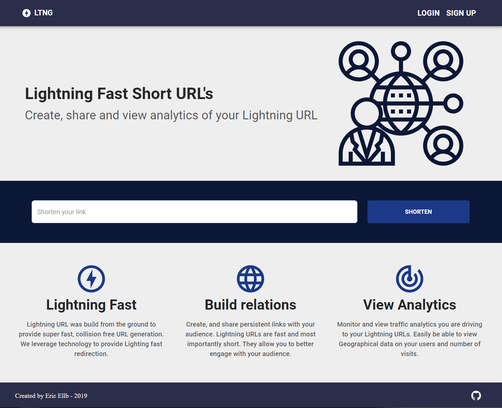

# Lightning URL

> Scalable URL Shortener written in TypeScript / Express with React frontend. Live Version @ http://ltng.xyz/

The goal of Lightning URL is to design a highly scalable URL shortener that does not have collisions when generating a new url and minimal number of database queries. The API servers sit behind a Load Balancer, as many API Servers can be booted as needed. Load balancing occurs in a round robin format. Analytic data is provided to the Creator of the short URL showing the Geo locations of visitors and total number of visits.



Implemented Features

- [x] Basic Scalable URL Shortener Backend
- [x] Backend Analytics (See visits, geographic data etc..)
- [x] Frontend for URL Shortener

Planned Features

- [ ] Frontend Auth + Analytics (Working on it..)

---

# API Documentation

## Shorten URL

Returns an Short URL for Given Destination URL.

If userId given allows you to pull analytic data and links shortened route to your userId

- **URL**

  /shorten

- **Method:**

  `POST`

- **URL Params**

  **Required:**

  `destination=[string]`

  **Optional:**

  `forceNewUrl=[boolean]`

  `userId=[string]`

* **Success Response:**

  - **Code:** 200 <br />
    **Content:** `slug : 0daajd`

* **Error Response:**

  - **Code:** 400 BAD REQUEST <br />
    **Content:** `Must provide a long url`

- **Sample Call:**

  ```javascript
    axios.post('/shorten?destination=www.google.com')
    .then((res) => {
    	console.log(res) -> "0004c92"
    }
  ```

## Get Redicretion URL

Returns the original URL for you to redirect the user to

- **URL**

  /:slug

- **Method:**

  `GET`

- **URL Params**

  **Required:**

  `slug=[string]`

* **Success Response:**

  - **Code:** 200 <br />
    **Content:** `destination : www.google.com`

* **Error Response:**

  - **Code:** 400 BAD REQUEST <br />
    **Content:** `Must provide a long url`

- **Sample Call:**

  ```javascript
    axios.get('/0004c92')
    .then((res) => {
    	console.log(res) -> "http://www.google.com"
    }
  ```

## Get Analytic Data

Returns the Analytic Data of a Short URL given your UserID is the creator

- **URL**

  /analytic/:slug

- **Method:**

  `GET`

- **URL Params**

  **Required:**

  `slug=[string]`

  `userId=[string]`

* **Success Response:**

  - **Code:** 200 <br />
    **Content:** `{ "urls_slug": "000BLjl", "creator_user_id": "some_user_id", "visits": 3, "worlds": "[{\"city\": \"Montreal\", \"visits\": \"2\", \"country\": \"Canada\", \"continent\": \"NA\"}]" }`

* **Error Response:**

  - **Code:** 401 UNAUTHORIZED <br />
    **Content:** `Unauthorized Route`

- **Sample Call:**

  ```javascript
    axios.get('/analytics/0004c92')
    .then((res) => {
    	console.log(res)
    }
  ```

## License

Copyright Eric Ellbogen 2019

- This project is under the **GNU V3** license. [Find it here](https://github.com/ericellb/Simple-URL/blob/master/LICENSE).
